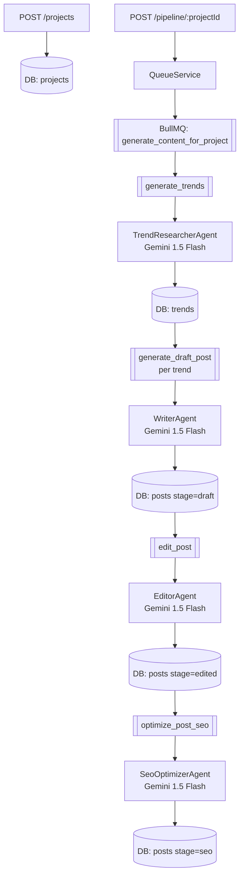

# Autonoma — Fluxo do App e Pipeline de Agentes

## Visão Geral

O **Autonoma** é uma API de geração automática de conteúdo para redes sociais. Dado um projeto com nicho e público-alvo, o sistema pesquisa tendências, escreve rascunhos, edita e otimiza posts para SEO de forma totalmente automatizada usando uma pipeline de agentes de IA.

**Stack:**

- **Framework**: NestJS (TypeScript)
- **Queue**: BullMQ (Redis via IORedis)
- **Banco de Dados**: PostgreSQL com Drizzle ORM
- **IA**: Google Gemini 2.0 Flash via Vercel AI SDK (`@ai-sdk/google`, `ai`)

---

## Arquitetura de Módulos

```
AppModule
├── QueueModule (Global)          → gerencia fila BullMQ e FlowProducer
├── ContentPipelineModule         → handlers de jobs e worker processor
└── ProjectsModule                → CRUD de projetos e consulta de resultados
```

O `QueueModule` é marcado como `@Global()`, então o `QueueService` fica disponível para todos os módulos sem reimportação.

O worker BullMQ é iniciado diretamente no `main.ts` via `startContentWorker()`, junto ao servidor HTTP.

---

## Endpoints da API

| Método | Rota                   | Descrição                                    |
| ------ | ---------------------- | -------------------------------------------- |
| `POST` | `/projects`            | Cria um novo projeto                         |
| `GET`  | `/projects/:id`        | Retorna dados do projeto                     |
| `GET`  | `/projects/:id/trends` | Lista as tendências geradas                  |
| `GET`  | `/projects/:id/posts`  | Lista os posts (`?stage=draft\|edited\|seo`) |
| `POST` | `/pipeline/:projectId` | Dispara a pipeline de geração de conteúdo    |

### Criar Projeto — `POST /projects`

```json
{
  "name": "Meu Blog",
  "niche": "tecnologia",
  "targetAudience": "desenvolvedores iniciantes",
  "toneOfVoice": "descontraído e didático"
}
```

### Iniciar Pipeline — `POST /pipeline/:projectId`

```json
{ "message": "Pipeline started 🚀" }
```

---

## Fluxo Completo

```
Cliente HTTP
    │
    ▼
POST /pipeline/:projectId
    │
    ▼
QueueService.startContentPipeline(projectId)
    │  Cria FlowProducer com hierarquia de jobs
    ▼
Redis (BullMQ)
    │
    ▼
Worker (content.processor.ts)
    │  Consome jobs da fila "content-pipeline"
    │  Despacha para HandlerRegistry
    │
    ├──► GenerateTrendsHandler
    │       └──► TrendResearcherAgent
    │               └── Salva trends no banco
    │               └──► (para cada trend) GenerateDraftPostHandler
    │                         └──► WriterAgent
    │                                 └── Salva post (stage: draft)
    │                                 └──► EditPostHandler
    │                                           └──► EditorAgent
    │                                                   └── Salva post (stage: edited)
    │                                                   └──► OptimizePostSeoHandler
    │                                                             └──► SeoOptimizerAgent
    │                                                                     └── Salva post (stage: seo)
    ▼
Banco de Dados (PostgreSQL)
```

---

## Pipeline de Jobs (BullMQ Flow)

A pipeline usa `FlowProducer` do BullMQ para criar uma árvore de jobs com relação pai-filho. Um job filho só executa após seu pai completar com sucesso.

```
[ROOT] generate_content_for_project
  └── generate_trends                     ← GenerateTrendsHandler
        └── post_pipeline_{trendId}        ← job orquestrador (sem handler)
              └── generate_draft_post      ← GenerateDraftPostHandler
                    └── edit_post          ← EditPostHandler
                          └── optimize_post_seo  ← OptimizePostSeoHandler
```

Para cada trend gerada (máximo 3), um sub-fluxo completo (`post_pipeline → draft → edit → seo`) é criado independentemente.

**Configuração de retry**: 3 tentativas com backoff exponencial (delay inicial de 3s).

---

## Agentes de IA

Todos os agentes implementam a interface genérica:

```typescript
interface Agent<Input, Output> {
  name: string;
  execute(input: Input): Promise<Output>;
}
```

Cada agente usa `generateText()` do Vercel AI SDK com o modelo `google/gemini-3-flash`.

---

### 1. TrendResearcherAgent

**Arquivo**: `src/modules/ai/agents/trend-researcher.agent.ts`

**Responsabilidade**: Identificar 3 tendências de conteúdo para o nicho e público do projeto.

|            |                                                           |
| ---------- | --------------------------------------------------------- |
| **Input**  | `{ niche: string, targetAudience: string }`               |
| **Output** | `Array<{ title, description, keywords[], score (1-10) }>` |

Usa saída estruturada com schema Zod para garantir o formato da resposta.

---

### 2. WriterAgent

**Arquivo**: `src/modules/ai/agents/writer.agent.ts`

**Responsabilidade**: Gerar o rascunho inicial do post para redes sociais (150-300 palavras) com hook, corpo e CTA.

|            |                                                   |
| ---------- | ------------------------------------------------- |
| **Input**  | `{ title, description, keywords[], toneOfVoice }` |
| **Output** | `{ content: string }`                             |

---

### 3. EditorAgent

**Arquivo**: `src/modules/ai/agents/editor.agent.ts`

**Responsabilidade**: Revisar e melhorar o rascunho — clareza, força do hook, consistência de tom e tamanho.

|            |                                               |
| ---------- | --------------------------------------------- |
| **Input**  | `{ content, title, keywords[], toneOfVoice }` |
| **Output** | `{ content: string }`                         |

---

### 4. SeoOptimizerAgent

**Arquivo**: `src/modules/ai/agents/seo-optimizer.agent.ts`

**Responsabilidade**: Otimizar o conteúdo para alcance orgânico, incorporar keywords naturalmente e adicionar 5-10 hashtags relevantes.

|            |                                  |
| ---------- | -------------------------------- |
| **Input**  | `{ content, title, keywords[] }` |
| **Output** | `{ content: string }`            |

---

## Handlers e Despacho

O `HandlerRegistry` (`src/content-pipeline/handlers/handler.registry.ts`) mapeia nomes de jobs para instâncias de handlers:

```typescript
{
  generate_trends:      GenerateTrendsHandler,
  generate_draft_post:  GenerateDraftPostHandler,
  edit_post:            EditPostHandler,
  optimize_post_seo:    OptimizePostSeoHandler,
}
```

Jobs com prefixos `post_pipeline_*` e `generate_content_for_project` são jobs orquestradores — são ignorados pelo dispatcher (sem lógica de negócio própria).

Cada handler implementa:

```typescript
interface JobHandler {
  execute(job: Job, deps: HandlerDeps): Promise<void>;
}

interface HandlerDeps {
  flowProducer: FlowProducer; // para criar jobs filhos
  db: NodePgDatabase; // conexão com o banco
}
```

---

## Persistência e Modelo de Dados

Cada agente persiste seu resultado no banco antes de o próximo job executar. Isso garante tolerância a falhas: se um job falha, a retry recomeça com os dados já salvos anteriormente.

```
projects
  ├── id (UUID)
  ├── name
  ├── niche
  ├── targetAudience
  └── toneOfVoice

trends (FK → projects)
  ├── id (UUID)
  ├── projectId
  ├── title
  ├── description
  ├── keywords (JSON)
  └── score (1-10)

posts (FK → trends)
  ├── id (UUID)
  ├── trendId
  ├── version (incrementa a cada stage)
  ├── stage ('draft' | 'edited' | 'seo')
  └── content
```

Para cada trend, são criados **3 posts** com versões incrementais:

- `version 1, stage: draft` — saída do WriterAgent
- `version 2, stage: edited` — saída do EditorAgent
- `version 3, stage: seo` — saída do SeoOptimizerAgent

---

## Diagrama Mermaid



---

## Infraestrutura Necessária

| Serviço       | Uso                    | Configuração                           |
| ------------- | ---------------------- | -------------------------------------- |
| PostgreSQL    | Armazenamento de dados | `DATABASE_URL` env var                 |
| Redis         | Backend do BullMQ      | `localhost:6379` (padrão)              |
| Google AI API | Gemini 2.0 Flash       | `GOOGLE_GENERATIVE_AI_API_KEY` env var |
